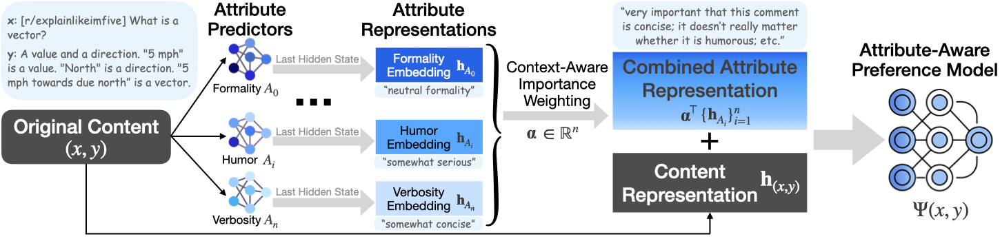

<div align="center">



# PrefPalette: Personalized Preference Modeling with Latent Attributes
  
[Shuyue Stella Li](https://stellalisy.com/), 
[Melanie Sclar](https://msclar.github.io/), 
[Hunter Lang](https://web.mit.edu/hjl/www/), 
[Ansong Ni](https://niansong1996.github.io/), 
[Jacqueline He](https://jacqueline-he.github.io/), 
[Puxin Xu](https://scholar.google.com/citations?user=VW1Bo1UAAAAJ&hl=en), 
[Andrew Cohen](https://scholar.google.com/citations?user=v1Frtb0AAAAJ&hl=en), 
[Chan Young Park](https://chan0park.github.io/), 
[Yulia Tsvetkov](https://homes.cs.washington.edu/~yuliats/), 
[Asli Celikyilmaz](http://asli.us/)
</div>

<div align="center">

[](https://arxiv.org/abs/2507.13541) 
[](https://github.com/stellalisy/PrefPalette)
[](LICENSE)

</div>

## Overview

**PrefPalette** is a framework for personalized preference modeling that decomposes preferences into interpretable attribute dimensions and learns context-dependent attribute weights for preference prediction. Grounded in multi-attribute decision making from cognitive science, PrefPalette:

1. **Learns attribute representations** via counterfactual knowledge distillation from a strong teacher LM (e.g., Llama 3.1 405B) to small specialized attribute predictors (e.g., Llama 3.2 1B)
2. **Integrates attributes into preference modeling** through an attention-based mechanism that dynamically weights 19 attribute dimensions (9 sociolinguistic norms + 10 Schwartz values)

When evaluated on 45 Reddit communities, PrefPalette outperforms GPT-4o by 46.6% in average preference prediction accuracy.

### Attributes

PrefPalette uses two categories of latent attributes:

**Sociolinguistic Norms (9):** verbosity, formality, supportiveness, sarcasm, humor, politeness, assertiveness, empathy, directness

**Schwartz Values (10):** Self-Direction, Stimulation, Hedonism, Achievement, Power, Security, Conformity, Tradition, Benevolence, Universalism

## Setup

```bash
git clone https://github.com/stellalisy/PrefPalette.git
cd PrefPalette

conda create -n prefpalette python=3.10
conda activate prefpalette

pip install -r requirements.txt
pip install -e .
```

> **Note:** This installs a modified fork of [OpenRLHF](https://github.com/OpenRLHF/OpenRLHF) with PrefPalette's attribute attention mechanism. If you have the upstream `openrlhf` package installed, it will conflict — use a dedicated conda environment.

## Full Pipeline

The PrefPalette pipeline takes raw Reddit data through 8 steps to produce a trained preference model. Each step can be run independently, or you can use `scripts/run_full_pipeline.sh` as a reference.

### Prerequisites

- **Raw Reddit data:** This pipeline expects Reddit comment/submission dumps in `.bz2` format. The original Pushshift dataset is no longer publicly available; archived copies may be found via [Academic Torrents](https://academictorrents.com/details/56aa49f9653ba545f48df2e33679f014d2829c10) or community mirrors on [r/pushshift](https://www.reddit.com/r/pushshift/).
- **GPU hardware:** Attribute predictor and preference model training require at least 1 GPU with DeepSpeed ZeRO Stage 1. Counterfactual generation with Llama 3.1 405B FP8 requires multiple high-memory GPUs (e.g., 4-8x A100 80GB or H100). Smaller teacher models can be substituted at reduced quality.
- **OpenAI API key (Step 8 only):** LLM judge evaluation uses GPT-4o by default, which requires an `OPENAI_API_KEY` environment variable. See [OpenAI API docs](https://platform.openai.com/docs/quickstart) for setup.

### Step 1a: Extract Reddit Data

Extract raw Reddit `.bz2` dumps into per-subreddit shard files:

```bash
bash scripts/preprocess_reddit.sh "data/raw/part-{idx}.bz2" data/preprocessed
```

### Step 1b: Consolidate Shards

Merge the per-shard files into single `{subreddit}_posts.jsonl` and `{subreddit}_comments.jsonl` files:

```bash
bash scripts/consolidate_shards.sh data/preprocessed data/subreddits.txt
```

### Step 2: Create Preference Pairs

Link comments to posts and create preference pairs based on upvote scores:

```bash
bash scripts/prepare_preference_pairs.sh data/preprocessed data/preference_pairs data/subreddits.txt
```

Output format (per subreddit): `train_2022.jsonl`, `eval_2022_comment.jsonl`, `eval_2022_post.jsonl`, `test_2022_comment.jsonl`, `test_2022_post.jsonl`

> **Temporal generalization:** The paper trains on 2022 data and evaluates temporal generalization on 2023 data. To generate 2023 test data, run a second pass: `python -m prefpalette.preprocessing.prepare_preference_pairs --input_dir data/preprocessed --output_dir data/preference_pairs --subreddits_file data/subreddits.txt --start_year 2023 --end_year 2024 --temporal_test_only 2000` and add `test_2023` to the config's `test_split`.

### Step 3: Generate Counterfactual Attribute Variations

Generate controlled counterfactual variations along 19 attribute dimensions using a strong teacher LM. Requires a running [vLLM](https://docs.vllm.ai/) endpoint:

```bash
# Start a vLLM endpoint first (in a separate terminal):
vllm serve meta-llama/Llama-3.1-405B-Instruct-FP8 --port 8000

# Then generate counterfactuals for each subreddit
bash scripts/counterfactual_generation.sh askdocs http://localhost:8000
```

### Step 4: Prepare Attribute Training Data

Convert counterfactual generations into pairwise training data for attribute predictors:

```bash
bash scripts/prepare_attribute_data.sh data/counterfactual data/attribute_training_data data/subreddits.txt
```

This creates 10 ordered pairs per comment per attribute dimension (from the 5-level rewrites), split into `train.jsonl`, `eval_comment.jsonl`, `eval_ood.jsonl`, `eval_level.jsonl`, `test_comment.jsonl`, `test_ood.jsonl`, `test_level.jsonl` for each attribute.

### Step 5: Train Attribute Predictors

Train a specialized reward model for each attribute dimension using contrastive distillation:

```bash
# Train one attribute predictor
bash scripts/train_attribute_predictor.sh verbosity

# Train all 19
for attr in verbosity formality supportiveness sarcasm humor politeness assertiveness empathy directness \
            Self-Direction Stimulation Hedonism Achievement Power Security Conformity Tradition Benevolence Universalism; do
    bash scripts/train_attribute_predictor.sh $attr
done
```

### Step 6: Generate Attribute Embeddings

Use trained attribute predictors to generate per-comment embeddings for the preference pair data:

```bash
# Generate embeddings for one attribute
bash scripts/generate_attribute_embeddings.sh verbosity askdocs

# Generate all embeddings for a subreddit
for attr in verbosity formality supportiveness sarcasm humor politeness assertiveness empathy directness \
            Self-Direction Stimulation Hedonism Achievement Power Security Conformity Tradition Benevolence Universalism; do
    bash scripts/generate_attribute_embeddings.sh $attr askdocs
done
```

Output: `data/attribute_embeddings/{subreddit}/1B/{attribute}.pkl` — pandas DataFrames indexed by comment ID with `score` and `embedding` columns.

### Step 7: Train PrefPalette Preference Model

Train the full attribute-mediated preference model with attention-based integration:

```bash
bash scripts/train_preference_model.sh askdocs all
```

The `all` argument uses all 19 attributes. You can also use `norms` (9 sociolinguistic norms only) or `values` (10 Schwartz values only).

### Step 8: Evaluate with LLM Judge

Evaluate preference prediction accuracy using LLM judges (e.g., GPT-4o). Requires `OPENAI_API_KEY`:

```bash
export OPENAI_API_KEY="your-key-here"
bash scripts/evaluate_llm_judge.sh askdocs gpt4o_clf
```

## Project Structure

```
PrefPalette/
├── openrlhf/                      # Modified OpenRLHF framework
│   ├── cli/
│   │   └── train_rm.py             # Reward model training entry point
│   ├── datasets/
│   │   └── reward_dataset.py       # Dataset with attribute embedding support
│   ├── models/
│   │   └── model.py                # RewardModel with attention-based attribute integration
│   └── trainer/
│       └── rm_trainer.py           # Trainer with gradual feature reduction
├── prefpalette/                    # PrefPalette pipeline modules
│   ├── preprocessing/
│   │   ├── preprocess_reddit.py    # Extract & consolidate Reddit data
│   │   └── prepare_preference_pairs.py  # Create upvote-based preference pairs
│   ├── counterfactual_generation/
│   │   ├── generate.py             # Counterfactual variation generation
│   │   ├── prepare_attribute_data.py  # Convert counterfactuals → training data
│   │   ├── verify.py               # Quality verification
│   │   ├── prompts.py              # Attribute definitions & prompt templates
│   │   └── llm_client.py           # vLLM client
│   └── evaluation/
│       ├── llm_judge.py            # Preference prediction evaluation
│       ├── annotator.py            # Annotator interface
│       └── completions.py          # API completions (vLLM, OpenAI)
├── scripts/                        # Pipeline shell scripts
│   ├── run_full_pipeline.sh        # Full pipeline reference script
│   ├── preprocess_reddit.sh        # Step 1a
│   ├── consolidate_shards.sh       # Step 1b
│   ├── prepare_preference_pairs.sh # Step 2
│   ├── counterfactual_generation.sh  # Step 3
│   ├── prepare_attribute_data.sh   # Step 4
│   ├── train_attribute_predictor.sh  # Step 5
│   ├── generate_attribute_embeddings.sh  # Step 6
│   ├── train_preference_model.sh   # Step 7
│   ├── evaluate_llm_judge.sh       # Step 8
│   └── launch_training.py          # DeepSpeed training launcher
├── configs/
│   ├── attribute_predictor/        # Attribute predictor YAML config
│   ├── preference_model/           # Preference model YAML config
│   └── llm_judge/                  # LLM judge annotator configs
├── data/
│   └── subreddits.txt              # Example subreddit list
├── figs/                           # Paper figures
├── setup.py                        # Package installation
├── requirements.txt                # Python dependencies
├── pyproject.toml                  # Build system config
└── LICENSE                         # Apache 2.0
```

## Key Components

### Attribute-Mediated Reward Model (`openrlhf/models/model.py`)

The core architectural modification adds an attention mechanism over attribute predictor embeddings:

- **Context attention mode (recommended):** Additive (Bahdanau-style) attention where the query comes from the content EOS hidden state and keys from attribute embeddings. Enable with `context_attention: true` in config.

The final hidden state combines content and attribute information:
`h_integrated = h_content + feature_score * Attn({h_attr_i})`

### Gradual Feature Reduction (`openrlhf/trainer/rm_trainer.py`)

During training, attribute features are stochastically dropped with increasing probability to encourage the model to internalize attribute patterns. This eliminates the need for attribute predictors at inference time.

### Counterfactual Attribute Synthesis (`prefpalette/counterfactual_generation/`)

Generates controlled counterfactual variations of text along 19 attribute dimensions at 5 intensity levels, creating clean pairwise training data for contrastive attribute distillation.

## Configurations

Training is configured via YAML files. See `configs/` for examples. Key parameters:

| Parameter | Description |
|---|---|
| `norm_training` | Enable attribute predictor training mode |
| `pref_training` | Enable attribute-mediated preference training |
| `feature_classifiers` | Comma-separated list of attribute dimensions |
| `feature_dataset` | Path to pre-computed attribute embeddings |
| `context_attention` | Use context-aware Bahdanau attention (recommended) |
| `feature_dropout` | Max feature dropout probability for gradual reduction |
| `include_time` | Include temporal metadata in prompts |
| `gen_norm` | Generate embeddings for a specific attribute |

## Data Format Reference

| Step | Input | Output |
|---|---|---|
| 1a Extract | `.bz2` Reddit dumps | `{subreddit}/{subreddit}_comments_{idx}.jsonl` |
| 1b Consolidate | Per-shard files | `{subreddit}_comments.jsonl`, `{subreddit}_posts.jsonl` |
| 2 Preference Pairs | Consolidated JSONL | `{subreddit}/train_2022.jsonl` (context/chosen/rejected) |
| 3 Counterfactual | Consolidated JSONL | `counterfactual_zeroshot_{subreddit}.jsonl` |
| 4 Attribute Data | Counterfactual JSONL | `{attribute}/train.jsonl` (context/chosen/rejected) |
| 5 Train Predictor | Attribute training data | Model checkpoint in `save_path` |
| 6 Embeddings | Preference pairs + model | `{subreddit}/1B/{attribute}.pkl` |
| 7 Train Model | Preference pairs + embeddings | PrefPalette model checkpoint |

## Paper

[PrefPalette: Personalized Preference Modeling with Latent Attributes](https://arxiv.org/abs/2507.13541)

## Citation

```bibtex
@inproceedings{liprefpalette,
  title={PrefPalette: Personalized Preference Modeling with Latent Attributes},
  author={Li, Shuyue Stella and Sclar, Melanie and Lang, Hunter and Ni, Ansong and He, Jacqueline and Xu, Puxin and Cohen, Andrew and Park, Chan Young and Tsvetkov, Yulia and Celikyilmaz, Asli},
  booktitle={Second Conference on Language Modeling},
  year={2025},
  url={https://arxiv.org/abs/2507.13541}, 
}
```

## License

This project is licensed under the [Apache License 2.0](LICENSE).

## Acknowledgments

This repository is built on [OpenRLHF](https://github.com/OpenRLHF/OpenRLHF).
